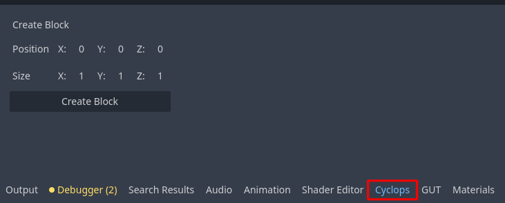
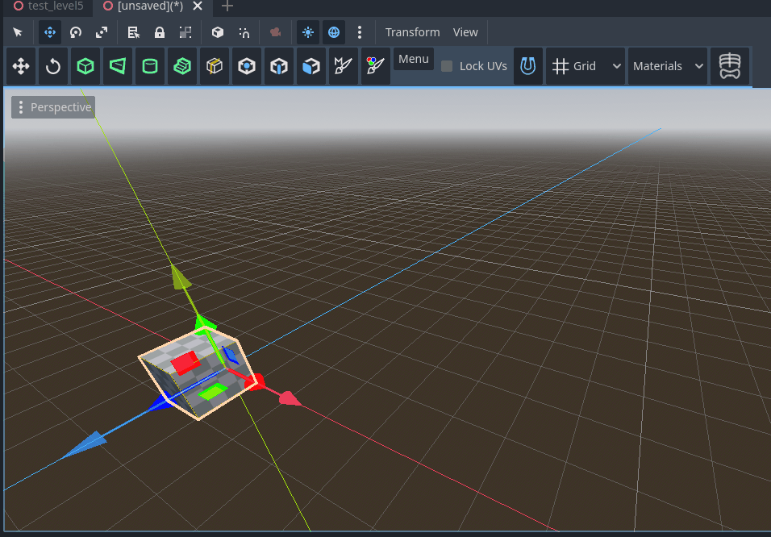

# Documentation

## Getting Started

### Create the CyclopsBlock environment root

You will need to begin with a 3D scene in Godot.  You can create a new empty scene, or modify a 3D scene you've already started working on.

Your first step to using Cyclops is to create a CyclopsBlock.  The Cyclops system currently requires a block to be selected for Cyclops to be activated (this is a limitation of how the Godot Editor works.)  The easiest way to do this is to select the Cyclops tab in the bottom center window and press the `Create Block` button.  This will create a basic block with the dimensions you specified in the work area.

You will now need to select this block to activate the tool menu.  You can continue creating blocks in this way, but will probably find it easier to use the `Block` tool to make new blocks.

### Creating more blocks

Make sure a `CyclopsBlock` is selected to show the Cyclops buttons in the editor toolbar.

Make sure the Block button is pressed, then click and drag in the viewport to start drawing your block.  You will need to click and drag to create the base, then move the mouse to drag out the height and click again to finish drawing the cube.

### Design considerations

Cyclops Level Builder uses convex blocks to build scenes.  This is means that no block in your scene can have indentations or inside corners.  You can still create scenes that have holes, arches and other concave architecture, but you will need to build them out of convex pieces.  Using the Clip tool can be very helpful to carve holes and empty spaces into convex blocks.

This is in the tradition of level design techniques from early 3D games such as Quake.  The advantages of using convex blocks is that it keeps things clean and convex collision detection is very fast.  However, it is less expressive and I might change this to use a general mesh in future updates to this project. 

Cyclops Level Builder also uses a grid and most operations will automatically snap vertices to the grid.  This is because in level design, you usually want walls, floors and ceiling to join up and be flush with each other.  Many other modeling programs make this difficult to do.

Most commands are undoable, so you can use Ctrl-Z to undo most actions and Ctrl-Shift-Z to redo them.

Most of the tools support pressing the Escape key to cancel the current operation.

## CyclopsBlock object

Each block you create is encapsulated in a CyclopsBlock object.  There are a number of properties on it that you can change.

* Collision Type - Affects the type of collision generated for the object
	* None - No collision
	* Static - A StaticBody3D will be used for collision
	* Kinematic - A CharacterBody3D will be used for collision
	* Rigid - A RigidBody3D will be used for collision

## Tools

Cyclops has many tools to let you create and edit your scene.

[Cyclops Tools](tools/index.md)

### Main Menu

The Menu has a number of useful commands.

* Duplicate Selected Blocks - Duplicates selected blocks.  Click with mouse to place duplication.
* Merge Selected Blocks - Combine all selected blocks into a single convex shape.
* Subtract Block - Subtract active block from all selected blocks
* Intersect Blocks - Replaces all selected blocks with their intersection
* Delete Selected Blocks - Delete all currently selected blocks.
* Snap to Grid - Snaps all vertices to the grid, just in case some are misaligned.

* Convert to Godot Mesh - Builds a replica of the CyclopsBlocks in your level using core Godot objects.  Places them inside a node called 'converted_blocks' at the root of your scene.
* Export As Gltf... - Generates a gltf file based on the current blocks in the scene.
* Export as Godot Scene - Creates a new scene file in your project that contains duplicates the current scene but where all the CyclopsBlock objects have been replaced with Godot library objects.
* Export as Cyclops File - Exports all Cyclops objects to a custom file format.  Allows for your cyclops scene to be stored in a format independent of the Godot scene file.  This is intended to help with transitioning between different Cyclops version which may not be backwards compatible.

* Rotate 90 Ccw X - Rotate 90 degrees counter clockwise around the X axis
* Rotate 90 Cw X - Rotate 90 degrees clockwise around the X axis
* Rotate 180 X - Rotate 180 degrees around the X axis
* Mirror Selection X - Mirror the selection in the X axis

* Rotate 90 Ccw Y - Rotate 90 degrees counter clockwise around the Y axis
* Rotate 90 Cw Y - Rotate 90 degrees clockwise around the Y axis
* Rotate 180 Y - Rotate 180 degrees around the Y axis
* Mirror Selection Y - Mirror the selection in the Y axis

* Rotate 90 Ccw Z - Rotate 90 degrees counter clockwise around the Z axis
* Rotate 90 Cw Z - Rotate 90 degrees clockwise around the Z axis
* Rotate 180 Z - Rotate 180 degrees around the Z axis
* Mirror Selection Z - Mirror the selection in the Z axis

### Cyclops Menu

A second menu has been created for import commands, since these need to be able to run even if no Cyclops block has been created.

* Import Godot MeshInstance - Will convert the currently selected Godot MeshInstance into a CyclopsBlock
* Import Cyclops File - Will import a file exported using the `Export as Cyclops File` command.

### Snapping

When the magnet button is pressed, snapping is enabled.  The dropdown allows you to switch between snapping modes.

[Snapping](snapping.md)

### Display Mode

The display mode lets you determine how blocks are displayed in the viewport.

## General Commands

* Ctrl-D will activate the duplicate tool.  When you type this in Block mode, the current selection will be duplicated and will follow the mouse cursor.  Click to drop the duplicated blocks at your desired location.

* X key to delete all selected blocks.
	* I wanted to use the Delete key, but this was causing a conflict with Godot so I went with the X key instead.

## Docks

When the CyclopsBlocks object is selected, extra docked windows will appear to give you further editng options:

* [Material](dock_material.md)
* [Face Properties](dock_face_properties.md)
* [Tool Properties](dock_tool_properties.md)

## Materials

Cyclops is designed to be able to use any material Godot supports.

There are a many different ways to create materials.  [Here is a quick overview if you're new to materials and want to dive in.](materials/material_quick_start.md)

## Support

If you found this software useful, please consider buying me a coffee on Kofi.  Every contribution helps me to make more software:

